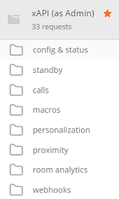
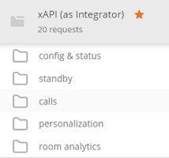

# Postman collections for Cisco CE xAPI

This repo gathers Postman collections for the [xAPI - API of the Cisco Collaboration Endpoint Software](https://www.cisco.com/c/dam/en/us/td/docs/telepresence/endpoint/software/ce9/release-notes/ce-software-release-notes-ce9.pdf).

**Make sure to configure the collection with these environment variables: `{{endpoint}}` and `{{credentials}}` variables. Check the [Configure your Environment](docs/ConfigureEnvVariables.md) page for guidance**

- [Admin role](#admin): use this collection is for Cisco Collaboration Endpoints that are registered on-premises and which you can access with an Admin account.

- [Integrator role](#integrator): use this collection if for Cisco Collaboration Endpoints that are Spark-registered, and CUCM registered devices that are accessed from a user with Integrator role.

Note that these collections do not list all xAPI commands available but a few use-cases to inspire application developers.

**We welcome pull requests for enhancements of existing collections, as well as contributions of collections that proved to be handy for you.  When submitting a new collection, please ensure it leverages a {{endpoint}} variable to ease environments sharing among collections. Thank you!** 

If you're new to Postman, you're only a few steps away from getting the full benefits of these collections:
1. [import a collection](docs/ImportCollection.md) 
2. [configure your environment](docs/ImportCollection.md)
3. [run a xAPI request](docs/xAPIrequest.md)
4. [generate code](docs/GenerateCode.md) for your favorite language
5. [optional] note that the postman suite lets you [run collections as part of your CI/CD process](https://www.getpostman.com/docs/newman_intro) via the newman command, and can also help you [publish documentation via documenter](https://www.getpostman.com/docs/creating_documentation).

## [admin](https://raw.githubusercontent.com/CiscoDevNet/postman-xapi/master/xapi-admin.json)

Use this collection for Cisco Collaboration Endpoints that are registered on-premises and for which have Admin credentials.

## [integrator](https://raw.githubusercontent.com/CiscoDevNet/postman-xapi/master/xapi-integrator.json)

Use this collection for Cisco Collaboration Endpoints that are registered on-premises or Spark-registered and for which have Integrator credentials.

# How to contribute

**We welcome pull requests for enhancements of existing collections, as well as contributions of collections that proved to be handy for you.  When submitting a new collection, please ensure it leverages {{endpoint}} and {{credentials}} variables to ease mutualization of environments among collections. Thank you!** 