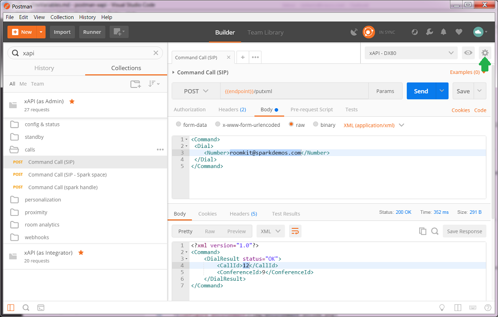
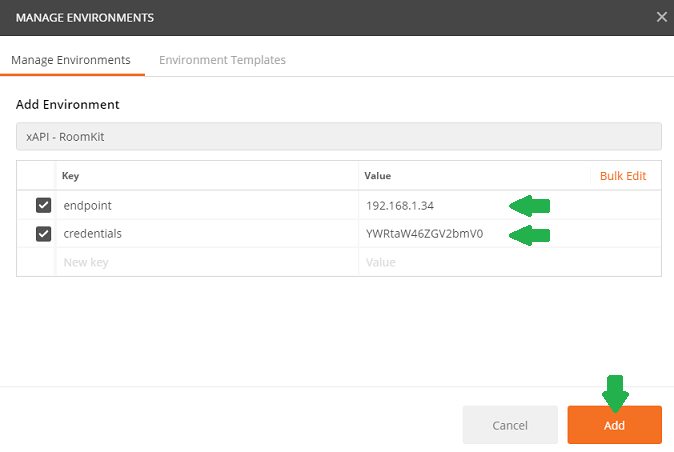
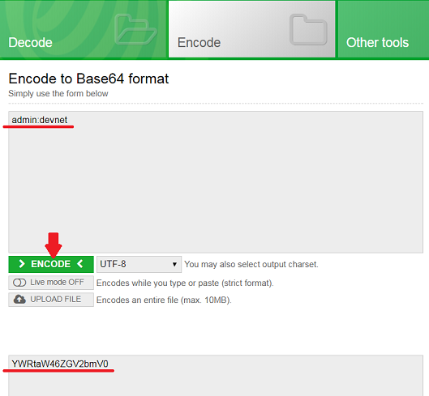
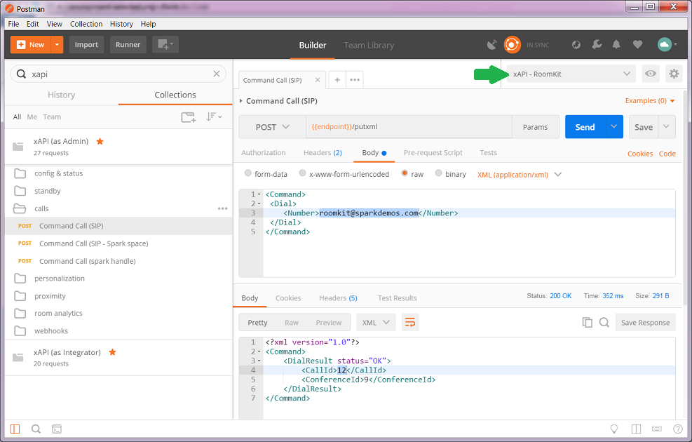

# Configure a Postman Environment

## Not a Postman user yet ?

The tool comes with a free plan.

[Download](https://www.getpostman.com/) as a Chrome or Desktop application.

## Configure your execution environement

Postman lets you define [environment variables](https://www.getpostman.com/docs/environments) to easilly abstract your execution contexts.

This is where we'll specify the `endpoint` and `credentials` variables required to access your Device.

To create a new environment, click on the `Environments options` wheel in the upper right corner, and select "Manage environments".

In the "Manage environments" list, click `Add` to create a new environment.

Fill in the "New Environment Form" with a name ('xAPI - Roomkit' in the example below), and create a first `endpoint` variable.
Enter the IP address of your device prefixed by 'http://' or 'https://'.

Then add a second variable that will hold the credentials to your device.
As xAPI use BasicAuth for authentication, type in the Base64 encoded string of your device username:password.

To assist you in this task, you can use an online service such as https://www.base64encode.org/.
Open the tool, and type `username:password` in the first text block.
Then click `Encode` and copy the generated string.

Once done, simply create 'Add', and pick a request among the proposed postman collections.

**Make sure that the environment you just created is selected before running the request**

> Tip: simply create [several environments to quickly switch](https://www.getpostman.com/docs/test_multi_environments) from one Device or Role to another.
