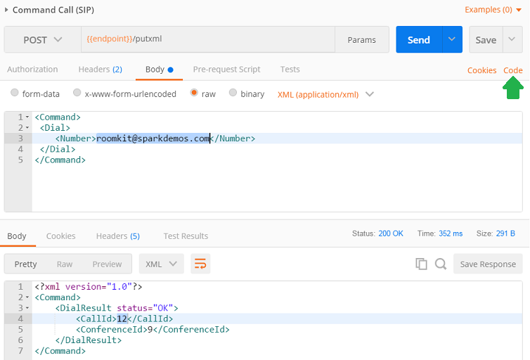
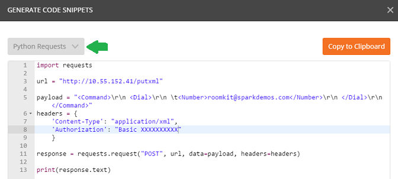
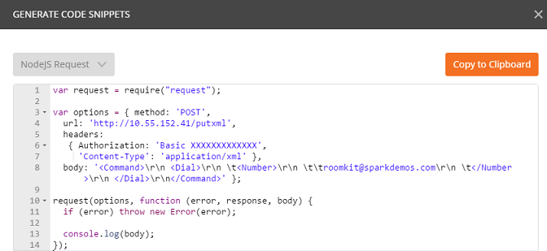

# Code Generation with Postman 

Postman lets you [generate code](https://www.getpostman.com/docs/code_snippets) in up to 15 languages.

Simply select a REST request in your collection, and click on the **Code** link, right under the Save button.

As the code generation popup opens, pick your favorite language from the combo.

Check the code generated by postman.

As an example:
- import the [xapi-integrator](../#admin) collection,
- expand the `calls` folder,
- select the `Command Call (SIP)` request,
- click the `Code` link as illustrated above.

Here is the code you'll get if you ask postman to generate a nodejs/request code snippet:

Note that if you get any extra "postman-token" or "cache" header, simply remove these manually when you'll paste the code into your app.
