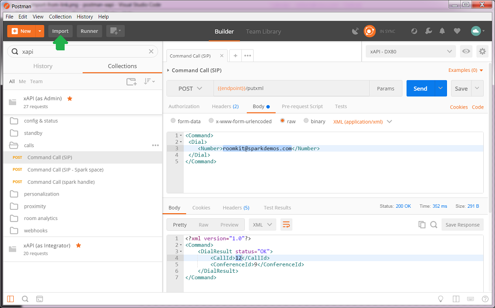
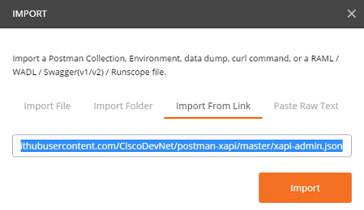

# Import a Postman Collection

## Not a Postman user yet ?

The tool comes with a free plan.

[Download](https://www.getpostman.com/) as a Chrome or Desktop application.

## How to import a collection into postman

Click on the import button on the top left corner 

Select "Import from link" and specify the URL of the collection to import.
For example, paste the [link to the xapi-main collection](https://raw.githubusercontent.com/CiscoDevNet/postman-xapi/master/xapi-admin.json).

To pick another collection listed in this repo:
- click on the `json` file of the collection you want to import, 
- click raw
- copy the link from your browser URL
- paste the link into Postman's `Import From Link` feature
