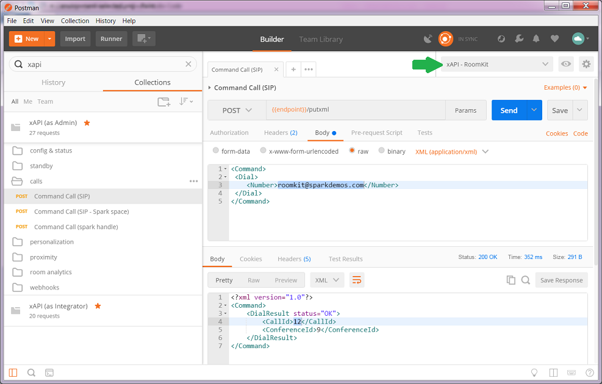

# Invoke a xAPI request

Once you've imported a xAPI collection and configured a postman environment for your device, you're ready to issue your first xAPI request.

Simply click on a request among the xAPI collection on the left, and click send.

**Make sure your environment is selected**

Start with a simple GET request in the `config & status` or `standby` request,
then pick the `Command Call` request in the `calls` folder to initiate a Video Call to an existing SIP demo address.

